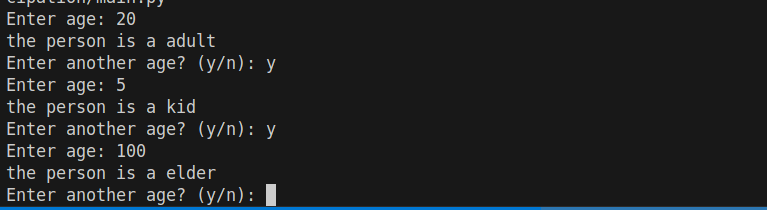

    
        Stage of Life Calculator
    

# Features 
Advanced Stage of Life Calculation
# Installation
Please add to system environment variables for quick access
# Usage

     
    <em>Main application interface and usage</em>

